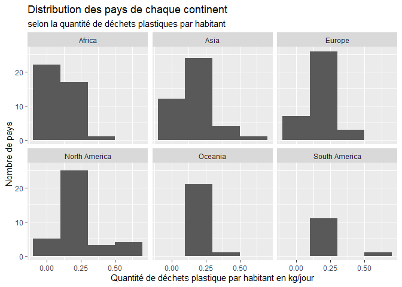
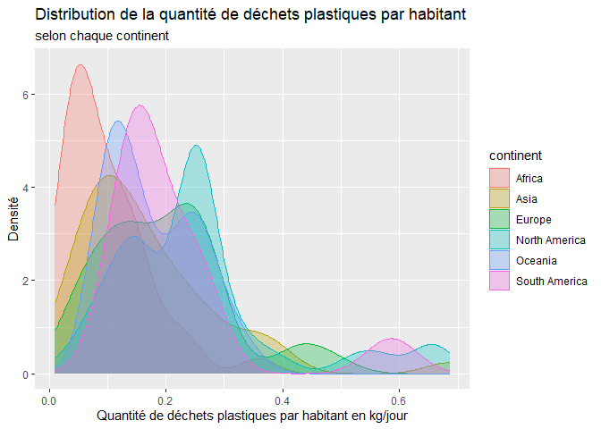
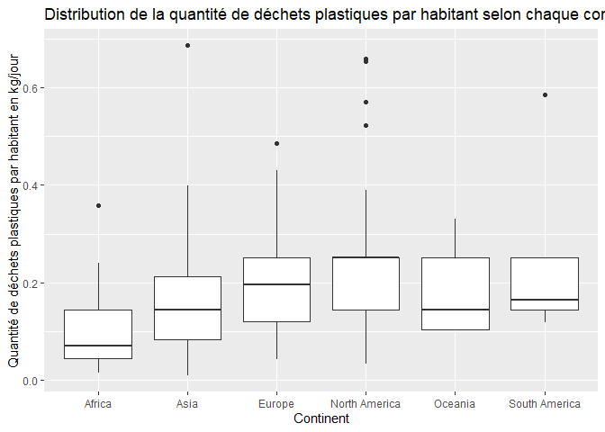
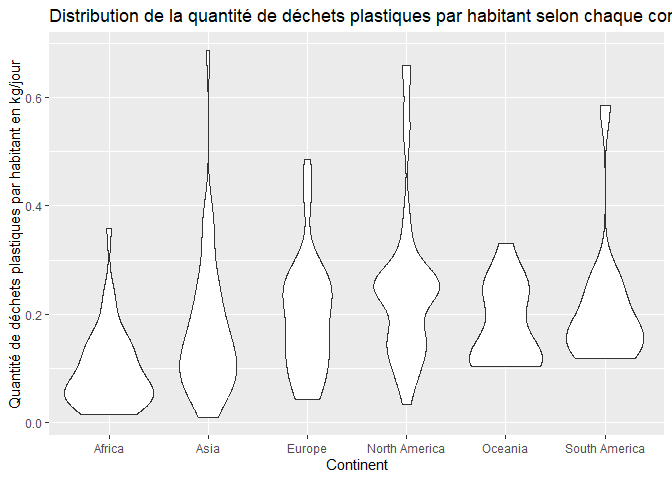
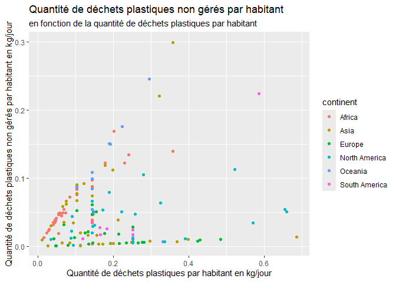
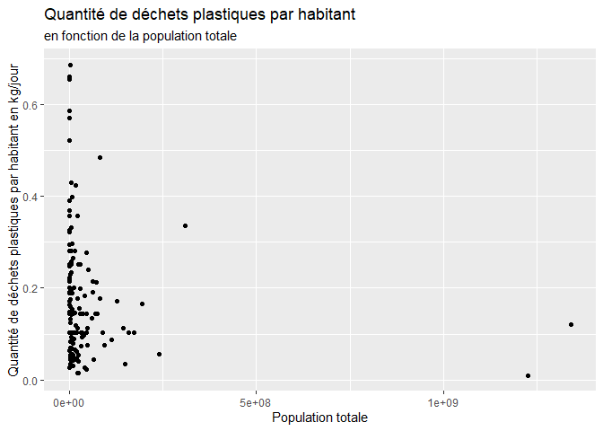
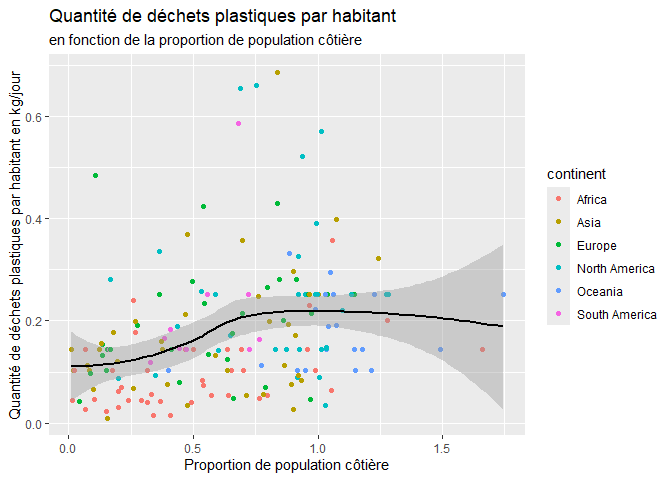

Lab 02 - Plastic waste
================
Frédérique Genest
15 septembre 2025

## Chargement des packages et des données

``` r
library(tidyverse) 
```

``` r
plastic_waste <- read_csv("data/plastic-waste.csv")
```

Commençons par filtrer les données pour retirer le point représenté par
Trinité et Tobago (TTO) qui est un outlier.

``` r
plastic_waste <- plastic_waste %>%
  filter(plastic_waste_per_cap < 3.5)
```

## Exercices

### Exercise 1

``` r
ggplot(plastic_waste,
       aes(x=plastic_waste_per_cap))+
  geom_histogram(binwidth = 0.20)+
  facet_wrap(~continent)
```

<!-- --> Selon
le graphique de comparaison entre les continents, on peut constater que
l’Amérique du Nord est celui qui compte le plus de pays ayant une
quantité de déchets plastiques par habitants supérieure à 0.50 kg/jour.
La majorité des pays ont une quantité de déchets d’environ 0.25 kg/jour.
On peut également constater que l’Afrique est le continent avec le plus
de pays comptant une quantité de déchets par habitant près de 0.00
kg/jour.

### Exercise 2

``` r
ggplot(plastic_waste,
       aes(x=plastic_waste_per_cap, fill=continent))+
  geom_density(alpha=0.3)
```

<!-- -->

Le réglage alpha se trouve dans geom_density parce qu’il est fixe et ne
dépend pas de variables. Ce réglage sert uniquement à l’esthétique du
graphique et à améliorer la lecture de celui-ci pour reconnaître les
tendences. Les régages color et fill sont plutôt dépendants des
variables parce que dans cet exemple, ils servent à différencier les
tendences de chaque continent. Les couleurs sont donc différentes pour
chaque continent tandis que le réglage alpha est le même pour tout le
graphique.

### Exercise 3

Boxplot:

``` r
ggplot(plastic_waste,
       aes(x=continent,y=plastic_waste_per_cap))+
  geom_boxplot()
```

<!-- -->

Violin plot:

``` r
ggplot(plastic_waste,
       aes(x=continent,y=plastic_waste_per_cap))+
  geom_violin()
```

<!-- -->

Les violin plots permettent de mieux voir la densité des

### Exercise 4

``` r
ggplot(plastic_waste,
       aes(x=plastic_waste_per_cap,y=mismanaged_plastic_waste_per_cap,color=continent))+
  geom_point()
```

<!-- -->

Réponse à la question…

### Exercise 5

``` r
ggplot(plastic_waste,
       aes(x=plastic_waste_per_cap,y=total_pop))+
  geom_point()
```

    ## Warning: Removed 10 rows containing missing values or values outside the scale range
    ## (`geom_point()`).

<!-- -->

``` r
ggplot(plastic_waste,
       aes(x=plastic_waste_per_cap,y=coastal_pop))+
  geom_point()
```

<!-- -->

Réponse à la question…

## Conclusion

Recréez la visualisation:

``` r
plastic_waste_coastal <- plastic_waste %>% 
  mutate(coastal_pop_prop = coastal_pop / total_pop) %>%
  filter(plastic_waste_per_cap < 3)
```

``` r
ggplot(plastic_waste_coastal,
       aes(x=coastal_pop_prop,y=plastic_waste_per_cap))+
  geom_point(aes(color=continent))+
  geom_smooth()
```

    ## `geom_smooth()` using method = 'loess' and formula = 'y ~ x'

    ## Warning: Removed 10 rows containing non-finite outside the scale range
    ## (`stat_smooth()`).

    ## Warning: Removed 10 rows containing missing values or values outside the scale range
    ## (`geom_point()`).

<!-- -->

interpréter…
